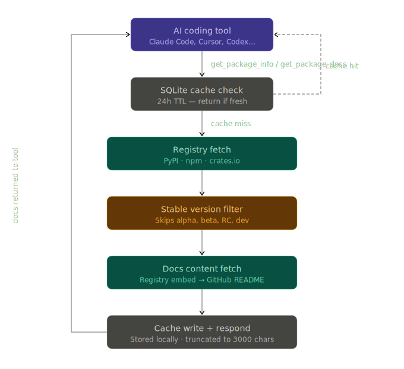

# Universal Docs MCP

MCP server that fetches latest **stable release** documentation for any package. Keeps AI coding agents up-to-date with current APIs instead of relying on stale training data.

## Why

LLMs are trained on a snapshot — the docs they "know" may be months or years old. This MCP gives Claude (or any MCP client) live access to the latest stable version info and documentation for packages across Python, JavaScript/TypeScript, and Rust.

## How it works

<p align="center">
  
</p>

## Features

- **Multi-ecosystem** — Python (PyPI), JavaScript/TypeScript (npm), Rust (crates.io)
- **Stable releases only** — Pre-release versions (alpha, beta, RC, dev) are filtered using proper version parsing
- **Cached** — SQLite cache with 24h TTL to avoid hammering registries
- **GitHub-aware** — Falls back to GitHub README when registry docs aren't available; supports optional `GITHUB_TOKEN` for higher rate limits
- **Context-efficient** — Documentation is truncated to 3000 characters to stay within LLM context budgets

## Tools

| Tool | Description |
|------|-------------|
| `get_package_info` | Get metadata: latest stable version, docs URL, description, license |
| `get_package_docs` | Fetch actual documentation content (README/description) |
| `cache_stats` | View cache hit/miss statistics |

### Example usage (from Claude Code)

```
> What's the latest version of flask?

> Show me the docs for the serde crate

> What license does express use?
```

## Setup

### With Claude Code

Add to your Claude Code MCP config (`~/.claude/claude_code_config.json`):

```json
{
  "mcpServers": {
    "universal-docs": {
      "command": "python3",
      "args": ["-m", "universal_docs_mcp.server"],
      "cwd": "/path/to/universal-docs-mcp"
    }
  }
}
```

Or with `uv` (no install needed):

```json
{
  "mcpServers": {
    "universal-docs": {
      "command": "uvx",
      "args": ["--from", "universal-docs-mcp", "universal-docs-mcp"]
    }
  }
}
```

### With Claude Desktop

Add to your Claude Desktop config (`~/Library/Application Support/Claude/claude_desktop_config.json` on macOS):

```json
{
  "mcpServers": {
    "universal-docs": {
      "command": "python3",
      "args": ["-m", "universal_docs_mcp.server"],
      "cwd": "/path/to/universal-docs-mcp"
    }
  }
}
```

## Install

```bash
# From PyPI
pip install universal-docs-mcp

# Or from source
git clone https://github.com/solmonger/universal-docs-mcp
cd universal-docs-mcp
pip install -e .
```

Requires Python 3.10+.

## Configuration

### GitHub Token (optional)

GitHub's unauthenticated API limit is 60 requests/hour. If you use this heavily, set a token to get 5,000 req/hr:

```bash
export GITHUB_TOKEN=ghp_your_token_here
```

No scopes required — a fine-grained token with no permissions works fine. The token is only used for fetching public README content.

### Cache

Documentation is cached in `~/.cache/universal-docs-mcp/cache.db` with a 24-hour TTL. Use the `cache_stats` tool to check cache state.

## Supported Ecosystems

| Ecosystem | Registry | Aliases |
|-----------|----------|---------|
| Python | PyPI | `python`, `pypi`, `pip` |
| JavaScript/TypeScript | npm | `javascript`, `typescript`, `npm`, `js`, `ts` |
| Rust | crates.io | `rust`, `cargo`, `crate` |

If no ecosystem is specified, all registries are tried in order.

## License

MIT
