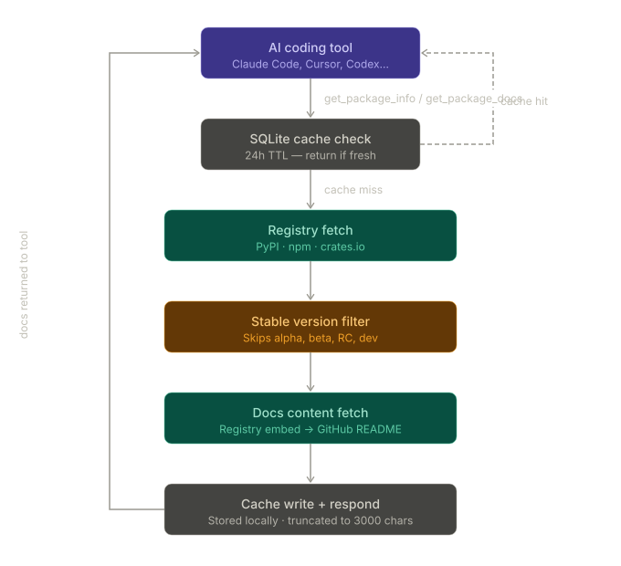

# Universal Docs MCP

MCP server that fetches latest **stable release** documentation for any package. Keeps AI coding agents up-to-date with current APIs instead of relying on stale training data.

## Why

LLMs are trained on a snapshot — the docs they "know" may be months or years old. This MCP gives Claude (or any MCP client) live access to the latest stable version info and documentation for packages across Python, JavaScript/TypeScript, and Rust.

## How it works

<p align="center">
  
</p>

## Features

- **Multi-ecosystem** — Python (PyPI), JavaScript/TypeScript (npm), Rust (crates.io)
- **Stable releases only** — Pre-release versions (alpha, beta, RC, dev) are filtered using proper version parsing
- **Cached** — SQLite cache with 24h TTL to avoid hammering registries
- **GitHub-aware** — Falls back to GitHub README when registry docs aren't available; supports optional `GITHUB_TOKEN` for higher rate limits
- **Context-efficient** — Raw upstream documentation is cached intact; compaction applies the requested output budget after retrieval

## Tools

| Tool | Description |
|------|-------------|
| `get_package_info` | Get metadata: latest stable version, docs URL, description, license |
| `get_package_docs` | Fetch compact, section-aware docs; supports exact versions and output budgets |
| `get_docs_outline` | Return a section map before spending context on a large README |
| `get_project_dependencies` | Read a supported manifest so agents can look up project-relevant versions |
| `cache_stats` | View cache hit/miss statistics |

### Agent workflow

The safe default is **discover the version, outline the docs, then fetch only what is needed**:

1. Call `get_project_dependencies` on the project's manifest.
2. Use the returned `pinned` version when one is available; otherwise use the declared range and ask for the latest stable.
3. Call `get_docs_outline` for the package/version.
4. Call `get_package_docs` with the chosen section slug, or request a compact view with `max_tokens`.

This keeps the upstream documentation authoritative and fresh while making the model-facing representation smaller and less noisy. The server caches the raw source separately from the compact view, so changing the token budget does not require another registry request.

## Setup

### With Claude Code

Add to your Claude Code MCP config (`~/.claude/claude_code_config.json`):

```json
{
  "mcpServers": {
    "universal-docs": {
      "command": "python3",
      "args": ["-m", "universal_docs_mcp.server"],
      "cwd": "/path/to/universal-docs-mcp"
    }
  }
}
```

Or with `uv` (no install needed):

```json
{
  "mcpServers": {
    "universal-docs": {
      "command": "uvx",
      "args": ["--from", "universal-docs-mcp", "universal-docs-mcp"]
    }
  }
}
```

### With Claude Desktop

Add to your Claude Desktop config (`~/Library/Application Support/Claude/claude_desktop_config.json` on macOS):

```json
{
  "mcpServers": {
    "universal-docs": {
      "command": "python3",
      "args": ["-m", "universal_docs_mcp.server"],
      "cwd": "/path/to/universal-docs-mcp"
    }
  }
}
```

## Install

```bash
# From PyPI
pip install universal-docs-mcp

# Or from source
git clone https://github.com/solmonger/universal-docs-mcp
cd universal-docs-mcp
pip install -e .
```

Requires Python 3.10+. On Python 3.10 the package uses the declared `tomli` compatibility dependency for TOML manifest parsing.

## Configuration

### GitHub Token (optional)

GitHub's unauthenticated API limit is 60 requests/hour. If you use this heavily, set a token to get 5,000 req/hr:

```bash
export GITHUB_TOKEN=ghp_your_token_here
```

No scopes required — a fine-grained token with no permissions works fine. The token is only used for fetching public README content.

### Cache

Documentation is cached in `~/.cache/universal-docs-mcp/cache.db` with a 24-hour TTL. Use the `cache_stats` tool to check cache state.

### Retrieval guarantees and limits

- An omitted version is resolved from registry metadata before fetching and caching. A new release gets a different raw-cache key; cached old text is not relabeled as new.
- `fetched_at` is the source-fetch Unix timestamp; `cached` reports reuse. `force_refresh: true` bypasses raw cache, not a guarantee that upstream authors updated their docs.
- This is README/registry-description retrieval, **not full API-site search or symbol verification**. A source URL is provided. Missing content is an explicit miss; transport failures/rate limits are unknown, not proof the package is absent.
- A GitHub fallback requests the version string as a Git ref. This does **not** prove that the ref corresponds to the published package artifact. Treat it as weaker evidence; monorepos and `v`-prefixed tags may miss. No silent default-branch fallback occurs.
- `max_tokens` bounds the **content** using a four-characters-per-token estimate. It does not bound the JSON metadata or actual model tokenization. Section responses mark truncation; do not execute a clipped code example. Use the source URL when a whole example will not fit.
- Compaction preserves fenced code and HTML prose. Sections are ranked by simple heading rules, not an LLM or semantic search. The outline exposes omitted sections.
- Making this MCP available in a client does not guarantee the client calls it. Prefer task-relevant retrieval over unconditional calls on every scheduled run.

## Supported Ecosystems

| Ecosystem | Registry | Aliases |
|-----------|----------|---------|
| Python | PyPI | `python`, `pypi`, `pip` |
| JavaScript/TypeScript | npm | `javascript`, `typescript`, `npm`, `js`, `ts` |
| Rust | crates.io | `rust`, `cargo`, `crate` |

If no ecosystem is specified, all registries are tried in order.

## License

MIT
